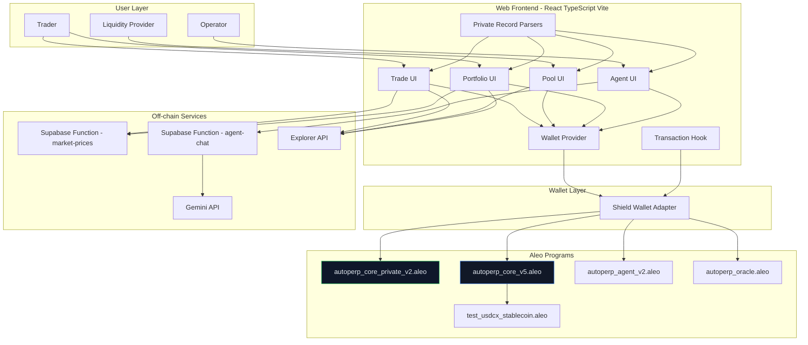

# AutoPerp

AutoPerp is a privacy-first perpetual trading protocol and application stack on Aleo.

It supports two core operating modes:

- Settlement mode (`autoperp_core_v5.aleo`): integrates with `test_usdcx_stablecoin.aleo` for real testnet settlement flows.
- Private mode (`autoperp_core_private_v2.aleo`): private record-based trading state with USDCx-backed collateral settlement.

## Mode Snapshots

Private open_position - autoperp_core_private_v2.aleo

<a href="https://ibb.co/jkbVXXkK"></a>

Public open_position - autoperp_core_v5.aleo

<a href="https://ibb.co/RpW122DN"></a>

Update: ~~autoperp_core_private_v1.aleo~~ → `autoperp_core_private_v2.aleo` with new features:

- USDCx-backed private collateral deposit/withdraw settlement
- improved private approval flow (4-step guided transactions)
- runtime mode support for Public/Private trading

## Product Summary

AutoPerp provides:

- Leveraged perpetual position lifecycle (open, manage, close)
- LP liquidity deposit/withdraw and fee accounting
- Agent authorization primitives for delegated actions
- Oracle-driven market pricing and risk references
- Web frontend with wallet-driven transaction execution

## Technology Stack

### Core

- Aleo smart contracts written in Leo
- React + TypeScript frontend
- Vite build system
- TailwindCSS UI system
- Shield wallet integration (`@provablehq/aleo-wallet-adaptor-*`)
- Supabase edge functions for AI chat and market data services

### Frontend Libraries

- React, React Router
- Framer Motion
- Sonner
- Radix UI primitives

### Backend/Services

- Supabase Functions (`agent-chat`, `market-prices`)
- Gemini API gateway (via Supabase function)

## Program Inventory

### Active Programs

- `autoperp_core_v5.aleo` (settlement-capable core)
- `autoperp_core_private_v2.aleo` (private record-based core)
- `autoperp_agent_v2.aleo` (AgentAuth and delegated execution receipts)
- `autoperp_oracle.aleo` (price, mark, funding state)
- `test_usdcx_stablecoin.aleo` (testnet USDCx token rails)

### Deprecated/Compatibility

- `autoperp_pool_v2.aleo` (legacy helper)

## Privacy Model

### Private Mode

`autoperp_core_private_v2.aleo` is a hybrid design:

- No public mappings for position/state accounting
- State transitions use private records (`TraderVault`, `PoolState`, `PositionRecord`, `LPToken`)
- Collateral settlement calls `test_usdcx_stablecoin.aleo` public transfer rails

### Settlement Mode

`autoperp_core_v5.aleo` is privacy-first but not fully private:

- Private position records are used
- Public settlement rails and public mappings still exist for token/accounting compatibility

## System Architecture



## Contract Roles

### `autoperp_core_private_v2.aleo`

Private record-based perpetual core:

- Private vault state (`TraderVault`)
- Private pool state (`PoolState`)
- Private position lifecycle (`PositionRecord`)
- Private LP accounting (`LPToken`, `FeeReceipt`, `ClaimableFeeEstimate`)

### `autoperp_core_v5.aleo`

Settlement-capable core with USDCx integration:

- Collateral deposit/withdraw
- Position open/close
- LP deposit/withdraw
- Fee accrual and claim

### `autoperp_agent_v2.aleo`

Delegated agent authorization model:

- AgentAuth grant/revoke
- Scoped permissions and expiry
- Execution receipts

### `autoperp_oracle.aleo`

Oracle references:

- Price updates
- Mark price updates
- Funding rate updates

## Frontend Contract Wiring

Program IDs are hardcoded in code (no runtime env switching for core/agent/oracle/pool):

- `PROGRAMS.CORE`: `autoperp_core_private_v2.aleo`
- `PRIVATE_CORE_PROGRAM`: `autoperp_core_private_v2.aleo`
- `PUBLIC_CORE_PROGRAM`: `autoperp_core_v5.aleo`
- `PROGRAMS.AGENT`: `autoperp_agent_v2.aleo`
- `PROGRAMS.ORACLE`: `autoperp_oracle.aleo`
- `PROGRAMS.POOL`: `autoperp_pool_v2.aleo`

Trading mode is selected in-app (Public/Private switch), and resolves to the corresponding hardcoded core program.

## Liquidity Pools

This section explains exactly how AutoPerp liquidity pools work, how LP fees are generated, and how `Estimated Claimable Fees` is calculated.

### 1) What A Liquidity Pool Does

- Each market has its own pool: BTC-USD (`0u8`), ETH-USD (`1u8`), ALEO-USD (`2u8`).
- Traders pay protocol fees when opening positions.
- Those fees accumulate in that market's `pool_fees`.
- LPs earn a pro-rata share of `pool_fees` based on LP shares.

In settlement/public core (`autoperp_core_v5.aleo`), LP fee claims are paid directly to wallet using `transfer_public`.

### 2) Deposit And Shares Logic

When a depositor adds `amount` USDCx liquidity:

- LP token `shares = amount`
- LP token `deposit_amount = amount`
- Pool totals update:
    - `pool_balance += amount`
    - `pool_deposits += amount`
    - `pool_shares += amount`

So shares are a 1:1 accounting unit with deposited amount at mint time.

### 3) How Trading Fees Are Generated

On position open, fee is charged from notional size:

$$
	ext{notional} = \text{collateral} \times \text{leverage}
$$

$$
	ext{fee} = \text{notional} \times 0.06\% = \text{notional} \times \frac{6}{10000}
$$

Equivalent integer formula used on-chain:

$$
	ext{fee} = \frac{\text{size} \times 6}{10000}
$$

That fee is added to `pool_fees` for the selected market.

### 4) Estimated Claimable Fees Formula

UI uses:

$$
	ext{Estimated Claimable Fees} = \frac{\text{your shares} \times \text{total pool fees}}{\text{total pool shares}}
$$

This is an estimate and can move as:

- new LP deposits change `total pool shares`
- more trading activity changes `total pool fees`
- other LPs claim fees (reducing `total pool fees`)

### 5) Worked Example (1000 USDCx Depositor)

Assume you deposit `1000` USDCx into BTC pool.

Case A:

- Total pool shares after your deposit = `50,000`
- Your shares = `1,000`
- Accrued pool fees = `300` USDCx

Then:

$$
	ext{your claim estimate} = \frac{1000 \times 300}{50000} = 6 \text{ USDCx}
$$

Case B (dilution after new deposits):

- Your shares remain `1,000`
- Total pool shares grow to `100,000`
- Pool fees remain `300`

Then:

$$
	ext{your claim estimate} = \frac{1000 \times 300}{100000} = 3 \text{ USDCx}
$$

Your absolute shares did not change, but your percentage of the pool decreased.

### 6) Public Claim Behavior

- Fee claim to wallet is public-mode only.
- Claim transaction uses LP token input + current `pool_shares` + current `pool_fees`.
- On success, USDCx is transferred to the claimer wallet and `pool_fees` decreases by claimed amount.

### 7) Why You May See Estimate But Cannot Claim Public

If you are viewing private LP state (or deposited in private mode), UI can show estimated fees for that state, but public claim requires a public LP token record.

Use Pool mode switch:

- `Public` mode: public deposit/public LP shares/public fee claim to wallet
- `Private` mode: private LP state path (no public wallet claim flow)

### 8) Lock Notice

Pool UI displays: `Deposited liquidity is locked for 2 years` as product policy text.

## Build and Deploy

## Build and Deploy

### Contract Build Order

```bash
cd programs/autoperp_oracle && leo build
cd ../autoperp_agent && leo build
cd ../autoperp_core && leo build
cd ../autoperp_core_private && leo build
```

### Frontend

```bash
npm install
npm run dev
npm run build
```

## Environment Variables

- `VITE_SUPABASE_PROJECT_ID`
- `VITE_SUPABASE_URL`
- `VITE_SUPABASE_PUBLISHABLE_KEY`
- `GEMINI_API_KEY` (for Supabase `agent-chat` function)

## License

MIT

## Operational Notes

- Private mode keeps position/state records private while collateral settlement legs use USDCx public rails.
- Settlement mode prioritizes token settlement compatibility with USDCx rails.
- Ensure frontend program IDs match the deployed contract IDs before running user flows.
