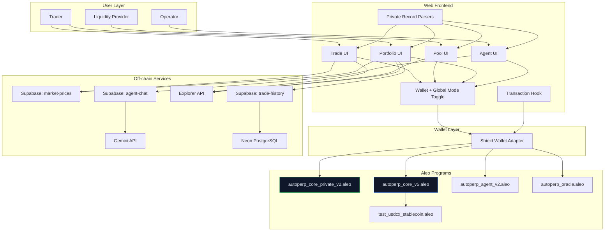

# AutoPerp

AutoPerp is a privacy-first perpetual trading protocol built on Aleo. It provides leveraged perpetual futures with on-chain settlement, a dedicated oracle system, an AI-powered agent authorization framework, and a full-featured web frontend.

The protocol operates in two core modes:

- **Public Settlement Mode** via `autoperp_core_v5.aleo`, integrating with `test_usdcx_stablecoin.aleo` for real testnet USDCx settlement.
- **Private Record Mode** via `autoperp_core_private_v2.aleo`, using encrypted Aleo records for all position, vault, and pool state with no public mappings.

---

## Table of Contents

- [On-Chain Programs](#on-chain-programs)
- [Oracle System](#oracle-system)
- [Liquidity Pool Mechanics](#liquidity-pool-mechanics)
- [Agent Authorization Framework](#agent-authorization-framework)
- [Privacy Architecture](#privacy-architecture)
- [Frontend Application](#frontend-application)
- [System Architecture](#system-architecture)
- [Technology Stack](#technology-stack)
- [Frontend Contract Wiring](#frontend-contract-wiring)
- [Build and Deploy](#build-and-deploy)
- [Environment Variables](#environment-variables)
- [Operational Notes](#operational-notes)
- [License](#license)

---

## On-Chain Programs

AutoPerp deploys five independent Aleo programs, each responsible for a distinct domain of the protocol.

### Active Programs

| Program | Purpose |
|---|---|
| `autoperp_core_v5.aleo` | Public settlement core with USDCx collateral integration |
| `autoperp_core_private_v2.aleo` | Fully private record-based trading core |
| `autoperp_agent_v2.aleo` | Delegated agent authorization and execution receipts |
| `autoperp_oracle.aleo` | Oracle price feeds, TWAP mark pricing, and funding rates |
| `test_usdcx_stablecoin.aleo` | Testnet USDCx stablecoin token rails |

### Deprecated

| Program | Note |
|---|---|
| `autoperp_pool_v2.aleo` | Legacy pool helper, no longer used in active flows |

### Record Types

The protocol defines nine distinct Aleo record types across its programs:

| Record | Program | Description |
|---|---|---|
| `PositionRecord` | Core (both) | Encrypted perpetual position with market, direction, collateral, leverage, entry price, size, SL/TP |
| `LiquidationAuth` | Core (both) | Authorization record issued to agent for liquidation monitoring |
| `TraderVault` | Private core | Encrypted trader balance record (no public mapping exposure) |
| `PoolState` | Private core | Encrypted pool accounting record (balance, deposits, shares, fees, OI, position count) |
| `LPToken` | Core (both) | LP ownership record with pool ID, shares, and deposit amount |
| `FeeReceipt` | Core (both) | Proof of fee claim with pool ID and claimed amount |
| `ClaimableFeeEstimate` | Core (both) | Read-only estimate of claimable fees based on current pool state |
| `AgentAuth` | Agent | Scoped, revocable delegation record with bitmask permissions and block-height expiry |
| `ExecutionReceipt` | Agent | Proof that an agent executed an action on behalf of a trader |

---

## Oracle System

`autoperp_oracle.aleo` implements a standalone on-chain oracle with admin-guarded price feeds, time-weighted average price (TWAP) mark pricing, and divergence-based funding rate calculation.

### Key Features

| Feature | Implementation |
|---|---|
| Price Feeds | `mapping prices: u8 => u64` — per-market 8-decimal precision |
| Mark Price (TWAP) | `update_mark_price()` — 70/30 weighted TWAP blend |
| Funding Rate | `update_funding_rate()` — divergence-based with direction flag |
| Confidence Interval | `mapping price_confidence: u8 => u64` — per-market confidence |
| Admin-guarded updates | `oracle_admin` mapping with BHP256 hash verification |
| Timestamps | `price_timestamps` mapped to `block.height` |

### Transitions

**`initialize(admin)`** -- One-time setup. Stores the BHP256 hash of the admin address. Rejects if already initialized.

**`update_price(market_id, price, confidence)`** -- Updates the oracle price, timestamp (block height), and confidence interval for a given market. Caller must match the stored admin hash (verified in finalize via BHP256).

**`update_mark_price(market_id)`** -- Computes a TWAP-blended mark price using the formula:

```
mark_price = (oracle_price * 7 + last_mark_price * 3) / 10
```

This 70/30 weighting smooths out short-term price fluctuations while remaining responsive to oracle updates.

**`update_funding_rate(market_id)`** -- Calculates the funding rate based on mark-to-oracle price divergence:

```
rate = |mark_price - oracle_price| * 1,000,000 / oracle_price
direction = mark_price > oracle_price ? 0 (longs pay) : 1 (shorts pay)
```

### Supported Markets

| Market | ID |
|---|---|
| BTC-USD | `0u8` |
| ETH-USD | `1u8` |
| ALEO-USD | `2u8` |

---

## Liquidity Pool Mechanics

Each market has its own isolated liquidity pool. Traders pay protocol fees when opening positions, and those fees accumulate in the corresponding pool. LPs earn a pro-rata share of accrued fees based on their LP token shares.

### Core Mechanics

| Feature | Public Core (`v5`) | Private Core (`private_v2`) |
|---|---|---|
| Deposit liquidity | `deposit_liquidity()` | `deposit_liquidity()` |
| Withdraw liquidity | `withdraw_liquidity()` | `withdraw_liquidity()` |
| LP Token records | `LPToken { shares, deposit_amount }` | Same |
| Share tracking | `pool_shares` mapping | `PoolState.shares` record field |
| Fee accrual | `pool_fees` mapping | `PoolState.fees` record field |
| Pro-rata fee claim | `claim_fees()` with `FeeReceipt` | `claim_fees()` with `FeeReceipt` |
| Fee estimation | `estimate_claimable_fees()` | `estimate_claimable_fees()` |
| Open interest tracking | `open_interest` mapping | `PoolState.open_interest` |
| Position count | `position_count` mapping | `PoolState.position_count` |
| Multi-pool support | 3 pools (BTC, ETH, ALEO) | Same |

### Deposit and Share Logic

When a depositor adds `amount` USDCx liquidity:

- An `LPToken` record is minted with `shares = amount` and `deposit_amount = amount`
- Pool totals update: `pool_balance += amount`, `pool_deposits += amount`, `pool_shares += amount`

Shares are a 1:1 accounting unit with the deposited amount at mint time.

### Fee Generation

On position open, a fee is charged from notional size:

```
notional = collateral x leverage
fee = notional x 6 / 10000   (0.06%)
```

The fee is added to `pool_fees` for the selected market and deducted from the trader's collateral before the position is created.

### Fee Claim Formula

The estimated claimable fees for an LP are calculated as:

```
claimable = (your_shares x total_pool_fees) / total_pool_shares
```

This estimate fluctuates as new deposits change total shares, trading activity changes total fees, and other LPs claim their share.

### Claim Behavior

- Public mode: fee claims execute `transfer_public` to send USDCx directly to the claimer's wallet. The `claim_fees` transition verifies on-chain that the provided `total_pool_shares` and `total_pool_fees` match current mapping values before executing.
- Private mode: fee claims operate on private `PoolState` records without public settlement.

### Transitions

| Transition | Description |
|---|---|
| `deposit_liquidity(pool_id, amount)` | Deposit USDCx and receive LP token |
| `withdraw_liquidity(lp_token)` | Burn LP token and withdraw original deposit |
| `claim_fees(lp_token, total_pool_shares, total_pool_fees)` | Claim pro-rata fees to wallet (public mode) |
| `estimate_claimable_fees(lp_token, total_pool_shares, total_pool_fees)` | Read-only fee estimate |

---

## Agent Authorization Framework

`autoperp_agent_v2.aleo` implements a scoped, revocable delegation system that allows an AI agent to execute specific actions on behalf of a trader.

### Permission Model

Permissions use a bitmask stored in the `AgentAuth` record:

| Bit | Value | Permission |
|---|---|---|
| 0 | `1u8` | Liquidate |
| 1 | `2u8` | Close position |
| 2 | `4u8` | Adjust position |
| All | `7u8` | All permissions |

### Authorization Lifecycle

1. **Grant**: Trader calls `grant_auth(agent, position_hash, permissions, max_slippage, expiry)`. An `AgentAuth` record is created and the authorization is marked active in the `active_auths` mapping. Expiry is validated against `block.height`.

2. **Execute**: Agent calls `execute_agent_action(auth, action_type, execution_price)`. The finalize function verifies the authorization is active, not expired, and then deactivates it (single-use). An `ExecutionReceipt` record is produced and the agent's execution count is incremented.

3. **Liquidate**: Agent calls `liquidate_position(auth, current_price, liquidation_price)`. Requires the liquidation permission bit. Same single-use deactivation pattern.

4. **Revoke**: Trader calls `revoke_auth(auth)` to consume the record and mark the authorization inactive.

### Slippage Protection

The `max_slippage` field in `AgentAuth` records caps the maximum allowed slippage at 500 basis points (5%).

### Frontend Agent UI

- The Agent chat interface uses semantic color coding: green for LONG positions, red for SHORT positions.
- The Portfolio positions table marks agent-initiated trades with a "Yes" indicator for clear differentiation from manual trades.
- When the application is in Private Mode, the Agent tab is hidden from navigation and the Agent column is removed from the positions table. Navigating directly to the Agent page in Private Mode displays an informational unavailability notice.

---

## Privacy Architecture

### On-Chain Privacy Implementation

| Privacy Feature | AutoPerp Implementation |
|---|---|
| Private positions | `autoperp_core_private_v2.aleo` uses zero public mappings — all state is in encrypted records |
| Private vaults | `TraderVault` record — balance is never exposed on-chain |
| Private pool state | `PoolState` record — pool accounting stays encrypted |
| Private LP tokens | Records-only, no public mapping exposure |
| Hybrid settlement | Public USDCx transfer rails for compatibility, but position/vault state stays private |
| Database privacy | SHA-256 hashed wallet addresses, stripped TX hashes |
| Privacy-aware UI | Agent features hidden in Private Mode automatically |

### Off-Chain Privacy (Trade History Database)

AutoPerp uses a Neon PostgreSQL database via Supabase Edge Functions for fast trade history queries. The following privacy measures prevent exposure of sensitive data:

| Measure | Implementation |
|---|---|
| Wallet address hashing | SHA-256 hash computed client-side before any network transmission |
| Irreversibility | SHA-256 is a one-way function; database administrators cannot reverse hashes to wallet addresses |
| Anonymous trade data | Trade amounts, leverage, and prices are stored but cannot be linked to specific wallets |
| Deterministic querying | Users query their own data by hashing their connected address client-side and matching the hash |
| Transaction hash omission | The transaction hash is stripped and sent as an empty string to prevent correlation via block explorers |
| Server-side credentials | The Neon connection string is stored exclusively inside the Supabase Edge Function environment |

### Privacy-Aware UI

The frontend adapts its interface based on the active trading mode:

- The Agent navigation tab is hidden in Private Mode.
- The Agent column in the Portfolio positions table is removed in Private Mode.
- The Liquidity Pools page displays clear "Private" or "Public" badges next to each pool name and the deposit section heading.
- Trading mode is selected globally via the Header toggle and synchronized across all pages using custom events and local storage.

---

## Frontend Application

### Pages

| Page | Description |
|---|---|
| Trade | Leveraged perpetual trading with market selection, order form, and position management |
| Portfolio | Open positions, trade history, funding history, and PnL tracking |
| Pool | Liquidity deposit/withdraw, fee claim, and pool statistics |
| Agent | AI-powered trading assistant with Gemini API integration and on-chain execution |
| Faucet | Testnet USDCx token distribution |
| Docs | Protocol documentation and references |

### UI Features

- Dark theme with glassmorphism effects
- Framer Motion animations on page and component transitions
- Responsive layout with mobile navigation
- Real-time price ticker with 24-hour change indicators
- Global Private/Public mode toggle in the navigation header
- Interactive pool cards with glow effects on selection
- Color-coded trade indicators (green for LONG, red for SHORT)
- Toast notifications with Aleo Explorer links for transaction confirmation

---

## System Architecture


```mermaid
flowchart TB
    subgraph UserLayer["User Layer"]
        U1["Trader"]
        U2["Liquidity Provider"]
        U3["Operator"]
    end

    subgraph Frontend["Web Frontend"]
        F1["Trade UI"]
        F2["Pool UI"]
        F3["Portfolio UI"]
        F4["Agent UI"]
        F5["Wallet + Global Mode Toggle"]
        F6["Transaction Hook"]
        F7["Private Record Parsers"]
    end

    subgraph Wallet["Wallet Layer"]
        W1["Shield Wallet Adapter"]
    end

    subgraph Chain["Aleo Programs"]
        C1["autoperp_core_private_v2.aleo"]
        C2["autoperp_core_v5.aleo"]
        C3["autoperp_agent_v2.aleo"]
        C4["autoperp_oracle.aleo"]
        C5["test_usdcx_stablecoin.aleo"]
    end

    subgraph DataServices["Off-chain Services"]
        S1["Supabase: market-prices"]
        S2["Supabase: agent-chat"]
        S3["Gemini API"]
        S4["Explorer API"]
        S5["Supabase: trade-history"]
        S6["Neon PostgreSQL"]
    end

    U1 --> F1
    U1 --> F3
    U2 --> F2
    U3 --> F4

    F1 --> F5
    F2 --> F5
    F3 --> F5
    F4 --> F5

    F5 --> W1
    F6 --> W1
    F7 --> F1
    F7 --> F2
    F7 --> F3
    F7 --> F4

    W1 --> C1
    W1 --> C2
    W1 --> C3
    W1 --> C4

    C2 --> C5

    F4 --> S2
    S2 --> S3

    F1 --> S1
    F3 --> S1

    F1 --> S4
    F2 --> S4
    F3 --> S4

    F3 --> S5
    S5 --> S6

    classDef private fill:#0f172a,stroke:#22c55e,stroke-width:1px,color:#e2e8f0
    classDef hybrid fill:#111827,stroke:#3b82f6,stroke-width:1px,color:#e2e8f0
    class C1 private
    class C2 hybrid
```

---

## Technology Stack

### Core

- Aleo smart contracts written in Leo
- React 18 with TypeScript
- Vite build system
- TailwindCSS styling
- Shield wallet integration (`@provablehq/aleo-wallet-adaptor-react`, `@provablehq/aleo-wallet-adaptor-reactui`)

### Frontend Libraries

- React Router (client-side routing)
- Framer Motion (animations)
- Sonner (toast notifications)
- Radix UI primitives (accessible dialog components)
- Lucide React (icon system)

### Backend Services

- Supabase Edge Functions: `agent-chat`, `market-prices`, `trade-history`
- Gemini API (AI agent reasoning via Supabase function proxy)
- Neon PostgreSQL (trade history persistence with SHA-256 privacy layer)
- Aleo Explorer API (on-chain state queries and transaction verification)

---

## Frontend Contract Wiring

Program IDs are hardcoded in the frontend source:

| Constant | Program ID |
|---|---|
| `PROGRAMS.CORE` | `autoperp_core_private_v2.aleo` |
| `PRIVATE_CORE_PROGRAM` | `autoperp_core_private_v2.aleo` |
| `PUBLIC_CORE_PROGRAM` | `autoperp_core_v5.aleo` |
| `PROGRAMS.AGENT` | `autoperp_agent_v2.aleo` |
| `PROGRAMS.ORACLE` | `autoperp_oracle.aleo` |
| `PROGRAMS.POOL` | `autoperp_pool_v2.aleo` |

Trading mode is selected globally via the Header toggle. The selection is persisted to local storage and broadcast via a custom `autoperp:mode-changed` window event. All pages listen for this event and resolve the appropriate core program at the hook level.

---

## Build and Deploy

### Contract Build Order

```bash
cd programs/autoperp_oracle && leo build
cd ../autoperp_agent && leo build
cd ../autoperp_core && leo build
cd ../autoperp_core_private && leo build
```

### Frontend

```bash
npm install
npm run dev       # Development server
npm run build     # Production bundle
```

---

## Environment Variables

| Variable | Scope | Description |
|---|---|---|
| `VITE_SUPABASE_PROJECT_ID` | Frontend | Supabase project identifier |
| `VITE_SUPABASE_URL` | Frontend | Supabase API URL |
| `VITE_SUPABASE_PUBLISHABLE_KEY` | Frontend | Supabase publishable API key |
| `GEMINI_API_KEY` | Supabase secret | Gemini API key for the `agent-chat` edge function |
| `NEON_DATABASE_URL` | Supabase secret | Neon PostgreSQL connection string for the `trade-history` edge function |

---

## Operational Notes

- Private Mode keeps all position, vault, and pool state in encrypted Aleo records. The only public leg is the USDCx token transfer itself.
- Public Settlement Mode uses public mappings for vault and pool accounting to maintain compatibility with USDCx transfer rails.
- The Agent system operates exclusively in Public Mode. When Private Mode is active, Agent features are hidden from the UI.
- Ensure frontend program IDs match the deployed contract IDs on the target network before running user flows.
- All prices use 8-decimal precision (1 USD = 100,000,000). All USDCx amounts use 6-decimal precision (1 USDCx = 1,000,000 micro-units).

---

## License

MIT
