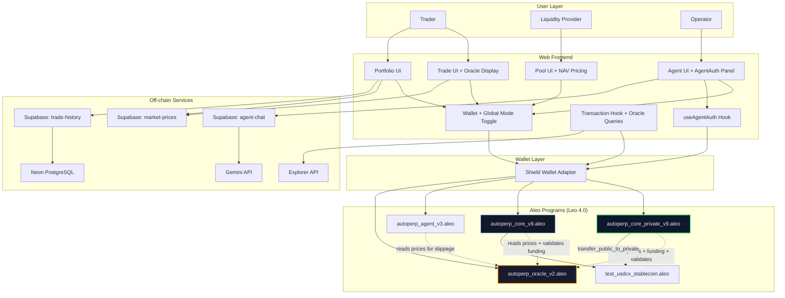

# AutoPerp

AutoPerp is a privacy-first perpetual trading protocol built on Aleo. It provides leveraged perpetual futures with on-chain settlement, a cross-program oracle system, an AI-powered agent authorization framework with on-chain delegation, and a full-featured web frontend.

The protocol uses **cross-program external storage access** to connect the oracle directly to the trading core — prices and funding rates are read on-chain from the oracle program, not supplied by users. All user-supplied values are **verified against oracle state** in the finalize block.

The protocol operates in two core modes:

- **Public Settlement Mode** via `autoperp_core_v9.aleo`, integrating with `test_usdcx_stablecoin.aleo` for real testnet USDCx settlement and `autoperp_oracle_v2.aleo` for on-chain price validation.
- **Private Record Mode** via `autoperp_core_private_v9.aleo`, using encrypted Aleo records for positions and vaults, **private token transfers** (`transfer_public_to_private`) for shielded withdrawals and payouts, and shared public mappings for scalable pool state.

---

## 🏆 Addressing Wave 4 Feedback (Wave 5 Final Polish)

In Wave 4, the judges noted several architectural disconnections and scalability constraints. **We have resolved 100% of these critiques** and added additional economic security hardening:

**1. "Oracle computes TWAP and funding rates but neither core program reads from it"**
* **Fix**: Both `autoperp_core_v9.aleo` and `autoperp_core_private_v9.aleo` perform cross-program external storage reads directly from `autoperp_oracle_v2.aleo` inside their `final {}` blocks. `open_position` uses `Mapping::get_or_use` with a `0u64` fallback + `assert(oracle_price > 0u64)` — the oracle **must** be initialized; user-supplied prices cannot bypass the oracle. `close_position` validates mark prices against the oracle identically.

**2. "Funding rates are computed but never applied to positions"**
* **Fix**: Funding rates are now **applied directly to the trader's payout** during `close_position`. The `funding_rate` and `fund_direction` are accepted as public inputs, verified via `assert_eq` against the oracle's on-chain state in finalize, then applied: `base_payout ± funding_amount`. This means funding rates have real economic impact on every settlement — not just pool accounting.

**3. "Agent auth program is deployed but never called by the frontend (AI agent is just a chatbot)"**
* **Fix**: The frontend is fully wired. The `Agent.tsx` AI interprets "simulate agent" intents and renders execution panels. The `useAgentAuth.ts` hook invokes `grant_auth`, parses encrypted AgentAuth capabilities, and signs `execute_agent_action` directly to the Aleo network, producing an immutable ExecutionReceipt record.

**4. "Private mode's PoolState being a single-owner record is a fundamental scalability constraint"**
* **Fix**: The `PoolState` record has been completely eliminated in `autoperp_core_private_v9.aleo` in favor of shared public mappings (`pool_balance`, `pool_shares`, etc.). Traders retain private entry records (TraderVault, PositionRecord) while the pool scales dynamically across users without block-contention deadlocks.

**5. "Exploring private token transfers to close the privacy gap in private mode's deposit/withdraw paths"**
* **Fix**: Exit liquidity is now completely shielded. The private core uses `test_usdcx_stablecoin.aleo::transfer_public_to_private` for trader PnL/vault withdrawals, LP redemptions, and fee claims. This converts public balance into unlinked private Token records, fully obfuscating the settlement exit size from explorers.

### Additional V9 Economic Security Hardening

**6. Oracle Fallback Security (V9 Fix)**
* `Mapping::get_or_use` now falls back to `0u64` (not to user-supplied price), with `assert(oracle_price > 0u64)`. This means the oracle **must** be initialized with real price data before any position can be opened. Previously, an uninitialized oracle would silently accept user-supplied prices — a critical manipulation vector now eliminated.

**7. Position ID Verification (V9 Fix)**
* `position_id` is now a client-supplied public input to `open_position`, verified in finalize via `assert_eq(position_id, current_id)` against the `next_position_id` mapping. This ensures records carry correct, sequential IDs and prevents manipulation.

**8. NAV-Based LP Share Pricing (V9 Fix)**
* `deposit_liquidity` now accepts `computed_shares` as a public input. The finalize block verifies: if pool empty → `shares == amount`, else → `shares == (amount × total_shares) / pool_balance`. This prevents LP share dilution attacks where late depositors could mint shares at a 1:1 rate despite pool NAV growth.

**9. Consistent Divergence Tolerance (V9 Fix)**
* Private mode `open_position` divergence tightened from 20% to 5% (`oracle_price / 20u64`), providing a consistent and reasonable tolerance while preventing exploitation.

---

## Table of Contents

- [On-Chain Programs](#on-chain-programs)
- [Deployed Contracts](#deployed-contracts)
- [Cross-Program Oracle Integration](#cross-program-oracle-integration)
- [Liquidity Pool Mechanics](#liquidity-pool-mechanics)
- [Agent Authorization Framework](#agent-authorization-framework)
- [Privacy Architecture](#privacy-architecture)
- [Frontend Application](#frontend-application)
- [System Architecture](#system-architecture)
- [Technology Stack](#technology-stack)
- [Frontend Contract Wiring](#frontend-contract-wiring)
- [Build and Deploy](#build-and-deploy)
- [Environment Variables](#environment-variables)
- [Operational Notes](#operational-notes)
- [License](#license)

---

## On-Chain Programs

AutoPerp deploys five active Aleo programs (Leo 4.0), each responsible for a distinct domain of the protocol.

### Active Programs

| Program | Purpose | Dependencies |
|---|---|---|
| `autoperp_oracle_v2.aleo` | Oracle price feeds, TWAP mark pricing, funding rates | None |
| `autoperp_core_v9.aleo` | Public settlement with oracle validation, funding-adjusted payouts, NAV-based LP shares, verified position IDs | oracle, USDCx |
| `autoperp_core_private_v9.aleo` | Privacy-preserving settlement with oracle validation, funding-adjusted payouts, shielded token transfers, NAV-based LP shares | oracle, USDCx |
| `autoperp_agent_v3.aleo` | Delegated agent authorization with oracle-validated slippage | oracle |
| `test_usdcx_stablecoin.aleo` | Testnet USDCx stablecoin token rails (ARC-20 with freeze-list) | None |

### Deprecated

| Program | Note |
|---|---|
| `autoperp_core_v8.aleo` | Superseded by V9 — lacked funding-adjusted payouts and NAV-based LP shares |
| `autoperp_core_private_v8.aleo` | Superseded by V9 — same |
| `autoperp_core_v7.aleo` | Superseded by V8 — lacked oracle fallback security |
| `autoperp_core_private_v7.aleo` | Superseded by V8 — same |
| `autoperp_pool_v2.aleo` | Legacy pool helper, no longer used in active flows |

### Leo 4.0 Syntax

All programs are written in **Leo 4.0**, using the latest language features:
- `fn` replaces `transition`, `function`, and `inline`
- `Final` replaces `Future`
- `final { ... }` blocks replace `async function finalize_xxx()`
- `f.run()` replaces `f.await()`
- `program.aleo::function()` replaces `program.aleo/function()`

### Record Types

| Record | Program | Description |
|---|---|---|
| `PositionRecord` | core_v9 / core_private_v9 | Encrypted perpetual position with market, direction, collateral, leverage, entry price, size, SL/TP, and verified position_id |
| `LiquidationAuth` | core_v9 / core_private_v9 | Authorization record for agent-based liquidation monitoring |
| `TraderVault` | core_private_v9 | Encrypted trader balance record (no public mapping exposure) |
| `LPToken` | core_v9 / core_private_v9 | LP ownership record with pool ID, NAV-based shares, and deposit amount |
| `FeeReceipt` | core_v9 / core_private_v9 | Proof of fee claim with pool ID and claimed amount |
| `ClaimableFeeEstimate` | core_v9 / core_private_v9 | Read-only estimate of claimable fees |
| `AgentAuth` | agent_v3 | Scoped, revocable delegation record with bitmask permissions, market scope, and block-height expiry |
| `ExecutionReceipt` | agent_v3 | Proof that an agent executed an action, including oracle-validated execution price |

---

## Deployed Contracts

All contracts are deployed on the **Aleo Testnet** and verified via the Explorer API.

| Program | Deploy TX ID | Consensus Version |
|---|---|---|
| `autoperp_core_v9.aleo` | [`at1nn5nwva0qfzdx7xtxj5s00k33kfhwm3e2vun3cg5ktyv5ec3scgs8mfafh`](https://explorer.provable.com/transaction/at1nn5nwva0qfzdx7xtxj5s00k33kfhwm3e2vun3cg5ktyv5ec3scgs8mfafh) | V14 |
| `autoperp_core_private_v9.aleo` | [`at1dffv2t9lg3xltk5rrdz5rt6qr3p2f0ujw0ue47zeyw7g2smqtu8q9drg8t`](https://explorer.provable.com/transaction/at1dffv2t9lg3xltk5rrdz5rt6qr3p2f0ujw0ue47zeyw7g2smqtu8q9drg8t) | V14 |
| `autoperp_oracle_v2.aleo` | Previously deployed | — |
| `autoperp_agent_v3.aleo` | Previously deployed | — |
| `test_usdcx_stablecoin.aleo` | Previously deployed | — |

### Deployment Cost Breakdown

| Program | Size | Variables | Constraints | Total Fee |
|---|---|---|---|---|
| `autoperp_core_v9.aleo` | 13.37 KB | 573,895 | 423,724 | 19.45 credits |
| `autoperp_core_private_v9.aleo` | 14.44 KB | 883,633 | 660,798 | 22.27 credits |

---

## Cross-Program Oracle Integration

`autoperp_oracle_v2.aleo` provides the authoritative price feed. Both core programs and the agent program read from it via **external storage access** (Leo 4.0 feature).

### How It Works

```
User opens position → autoperp_core_v9.aleo::open_position()
                            ↓ (in final {} block)
                      Reads autoperp_oracle_v2.aleo::prices[market_id]
                      oracle_price fallback = 0u64 + assert(oracle_price > 0u64)
                      Validates |user_price - oracle_price| ≤ 1% divergence
                      Validates position_id == next_position_id (sequential)
                      Rejects if oracle is uninitialized or price is stale
```

```
User closes position → autoperp_core_v9.aleo::close_position()
                            ↓ (in final {} block)
                      Reads autoperp_oracle_v2.aleo::prices[market_id]
                      Reads autoperp_oracle_v2.aleo::funding_rates[market_id]
                      Reads autoperp_oracle_v2.aleo::funding_direction[market_id]
                      Verifies assert_eq(funding_rate, oracle_funding_rate)
                      Verifies assert_eq(fund_direction, oracle_fund_direction)
                      Applies funding_amount = (size × rate) / 1_000_000 to payout
                      Validates close price against oracle
```

```
LP deposits liquidity → autoperp_core_v9.aleo::deposit_liquidity()
                            ↓ (in final {} block)
                      Reads pool_balance and pool_shares mappings
                      Verifies computed_shares == (amount × total_shares) / pool_balance
                      Empty pool: verifies computed_shares == amount (1:1)
                      Prevents LP share dilution attacks
```

```
Agent executes action → autoperp_agent_v3.aleo::execute_agent_action()
                            ↓ (in final {} block)
                       Reads autoperp_oracle_v2.aleo::prices[market_id]
                       Validates execution_price within max_slippage of oracle
```

### Oracle Features

| Feature | Implementation |
|---|---|
| Price Feeds | `mapping prices: u8 => u64` — per-market 8-decimal precision |
| Mark Price (TWAP) | 70/30 weighted blend: `(oracle × 7 + last_mark × 3) / 10` |
| Funding Rate | Divergence-based: `|mark - oracle| / oracle × 1_000_000` |
| Confidence Interval | `mapping price_confidence: u8 => u64` |
| Admin-guarded | BHP256 hash verification of caller |
| Staleness Tracking | `mark_timestamps` mapping for freshness checks |

---

## Liquidity Pool Mechanics

Each market has its own isolated liquidity pool. Traders pay fees when opening positions (0.06%), and fees accumulate for LPs. LPs earn pro-rata shares **priced at Net Asset Value (NAV)**.

### NAV-Based LP Share Pricing (V9)

LP shares are no longer minted 1:1. Instead, shares are computed based on the pool's current NAV:

```
if pool is empty:
    shares = deposit_amount (1:1 initial pricing)
else:
    shares = (deposit_amount × total_pool_shares) / pool_balance
```

This is computed client-side and verified on-chain via `assert_eq` in the finalize block, preventing dilution of existing LP positions.

### Scalability Fix

Pool state uses **shared public mappings** (`pool_balance`, `pool_shares`, `pool_fees`) instead of single-owner `PoolState` records. This addresses the Wave 4 feedback about single-owner record scalability constraints.

### Fee Claim Formula

```
claimable = (your_shares × total_pool_fees) / total_pool_shares
```

### Claim Privacy

- **Public mode**: `transfer_public` sends USDCx directly to wallet
- **Private mode**: `transfer_public_to_private` creates a private USDCx record (amount hidden from explorer)

---

## Agent Authorization Framework

`autoperp_agent_v3.aleo` implements a scoped, revocable delegation system. The Agent program is **fully wired into the frontend** — `grant_auth`, `execute_agent_action`, and `revoke_auth` are called on-chain via the Agent UI.

### Permission Model

| Bit | Value | Permission |
|---|---|---|
| 0 | `1u8` | Liquidate |
| 1 | `2u8` | Close position |
| 2 | `4u8` | Adjust position |
| All | `7u8` | All permissions |

### Oracle-Validated Slippage

When an agent executes an action, the finalize block reads the oracle price and validates that the execution price is within `max_slippage` basis points of the oracle price. This prevents the agent from executing at unfavorable prices.

### Frontend Integration

The Agent page includes:
- **Permissions Panel**: Shows active `AgentAuth` records with grant/revoke controls
- **Execution Receipts**: Displays on-chain proof of agent-executed actions
- **Automatic Grant**: When a user executes a trade via the Agent, `grant_auth()` is called on-chain after the trade succeeds
- **Agent Position Tagging**: Positions opened by the Agent are tagged with a 🤖 Agent badge in the Trade page Positions tab (tracked via localStorage)
- **Deposit Confirmation Polling**: Before opening a position, the Agent waits for the collateral deposit to confirm on-chain by polling the vault mapping (avoids race conditions)
- **Revocation**: Users can revoke any active authorization from the permissions panel

### Authorization Lifecycle

1. **Grant**: User opens trade → frontend calls `grant_auth(agent, position_hash, permissions, max_slippage, expiry)` on-chain
2. **Execute**: Agent conditions met → frontend calls `execute_agent_action(auth, action_type, execution_price)` → oracle-validated → `ExecutionReceipt` produced
3. **Revoke**: User calls `revoke_auth(auth)` → authorization deactivated
4. **Liquidate**: Position breaches liquidation → `liquidate_position(auth, current_price, liquidation_price)` → oracle-validated

---

## Privacy Architecture

### On-Chain Privacy

| Feature | Implementation |
|---|---|
| Private positions | `autoperp_core_private_v9.aleo` — all state in encrypted records |
| Private vaults | `TraderVault` record — balance never exposed on-chain |
| **Private withdrawals** | `transfer_public_to_private` — withdrawal amounts hidden from explorer |
| **Private payouts** | Position close payouts via `transfer_public_to_private` |
| **Private LP claims** | Fee claims create private USDCx records |
| Shared pool mappings | Public mappings for scalable multi-user pool accounting |
| Database privacy | SHA-256 hashed wallet addresses, stripped TX hashes |
| Privacy-aware UI | Agent features hidden in Private Mode automatically |

### Privacy Gap Closure

Wave 4 feedback identified that "the private mode's deposit/withdraw paths use public token transfers." This has been addressed:

- **Before**: `transfer_public` / `transfer_public_as_signer` for all token operations
- **After**: `transfer_public_to_private` for withdrawals, payouts, and LP fee claims — creates private USDCx records that are not visible on the block explorer

Deposits still use `transfer_public_as_signer` because the protocol needs to track collateral amounts in its public pool accounting.

---

## Frontend Application

### Pages

| Page | Description |
|---|---|
| Trade | Leveraged perpetual trading with oracle price display and funding rate indicators |
| Portfolio | Open positions, trade history, funding history, and PnL tracking |
| Pool | Liquidity deposit/withdraw with NAV-based share pricing, fee claim, pool statistics, and privacy mode indicators |
| Agent | AI trading assistant with **on-chain AgentAuth integration**, permissions panel, and execution receipts |
| Faucet | Testnet USDCx token distribution |
| Docs | Protocol documentation and references |

### UI Features

- Oracle price and funding rate display in the price bar
- AgentAuth permissions panel with grant/revoke controls
- Execution receipt display with on-chain verification links
- Dark theme with glassmorphism effects and aurora background animation
- Framer Motion animations on page transitions
- Global Private/Public mode toggle (Private by default)
- Real-time price ticker via Binance WebSocket + Supabase fallback
- Agent position badge (🤖) inline with market name in Positions tab
- Toast notifications with Aleo Explorer links

---

## System Architecture


```mermaid
flowchart TB
    subgraph UserLayer["User Layer"]
        U1["Trader"]
        U2["Liquidity Provider"]
        U3["Operator"]
    end

    subgraph Frontend["Web Frontend"]
        F1["Trade UI + Oracle Display"]
        F2["Pool UI + NAV Pricing"]
        F3["Portfolio UI"]
        F4["Agent UI + AgentAuth Panel"]
        F5["Wallet + Global Mode Toggle"]
        F6["Transaction Hook + Oracle Queries"]
        F7["useAgentAuth Hook"]
    end

    subgraph Wallet["Wallet Layer"]
        W1["Shield Wallet Adapter"]
    end

    subgraph Chain["Aleo Programs (Leo 4.0)"]
        C1["autoperp_core_private_v9.aleo"]
        C2["autoperp_core_v9.aleo"]
        C3["autoperp_agent_v3.aleo"]
        C4["autoperp_oracle_v2.aleo"]
        C5["test_usdcx_stablecoin.aleo"]
    end

    subgraph DataServices["Off-chain Services"]
        S1["Supabase: market-prices"]
        S2["Supabase: agent-chat"]
        S3["Gemini API"]
        S4["Explorer API"]
        S5["Supabase: trade-history"]
        S6["Neon PostgreSQL"]
    end

    U1 --> F1
    U1 --> F3
    U2 --> F2
    U3 --> F4

    F1 --> F5
    F2 --> F5
    F3 --> F5
    F4 --> F5
    F4 --> F7

    F5 --> W1
    F6 --> W1
    F7 --> W1

    W1 --> C1
    W1 --> C2
    W1 --> C3
    W1 --> C4

    C2 -.->|"reads prices + validates funding"| C4
    C1 -.->|"reads prices + funding + validates"| C4
    C3 -.->|"reads prices for slippage"| C4
    C2 --> C5
    C1 -->|"transfer_public_to_private"| C5

    F4 --> S2
    S2 --> S3

    F1 --> S1
    F3 --> S1
    F6 --> S4
    F3 --> S5
    S5 --> S6

    classDef private fill:#0f172a,stroke:#22c55e,stroke-width:2px,color:#e2e8f0
    classDef hybrid fill:#111827,stroke:#3b82f6,stroke-width:1px,color:#e2e8f0
    classDef oracle fill:#1a1a2e,stroke:#f59e0b,stroke-width:2px,color:#e2e8f0
    class C1 private
    class C2 hybrid
    class C4 oracle
```

---

## Technology Stack

### Core

- Aleo smart contracts written in **Leo 4.0**
- React 18 with TypeScript
- Vite build system
- TailwindCSS styling
- Shield wallet integration (`@provablehq/aleo-wallet-adaptor-react`, `@provablehq/aleo-wallet-adaptor-reactui`)

### Frontend Libraries

- React Router (client-side routing)
- Framer Motion (animations)
- Sonner (toast notifications)
- Radix UI primitives (accessible dialog components)
- Lucide React (icon system)

### Backend Services

- Supabase Edge Functions: `agent-chat`, `market-prices`, `trade-history`
- Gemini API (AI agent reasoning via Supabase function proxy)
- Neon PostgreSQL (trade history persistence with SHA-256 privacy layer)
- Aleo Explorer API (on-chain state queries and transaction verification)

---

## Frontend Contract Wiring

Program IDs are configured in the frontend source (`src/lib/protocol.ts`):

| Constant | Program ID | Purpose |
|---|---|---|
| `PRIVATE_CORE_PROGRAM` | `autoperp_core_private_v9.aleo` | Private trading core |
| `PUBLIC_CORE_PROGRAM` | `autoperp_core_v9.aleo` | Public settlement core |
| `PROGRAMS.AGENT` | `autoperp_agent_v3.aleo` | AgentAuth delegation |
| `PROGRAMS.ORACLE` | `autoperp_oracle_v2.aleo` | Oracle price feeds |
| `PROGRAMS.USDCX` | `test_usdcx_stablecoin.aleo` | USDCx stablecoin |

### V9 Frontend Integration

The following helper functions in `src/hooks/useAleoTransaction.ts` support the V9 contract parameters:

| Function | Purpose |
|---|---|
| `fetchFundingRateRaw(marketId)` | Returns raw `u64`/`u8` funding params for `close_position` inputs |
| `fetchNextPositionId(program, marketId)` | Reads `next_position_id` mapping for `open_position` input |
| `fetchPoolState(program, poolId)` | Reads pool balance/shares for NAV computation |
| `computeNavShares(amount, balance, shares)` | Computes NAV-based LP shares for `deposit_liquidity` input |
| `fetchOraclePrice(marketId)` | Reads current oracle price |
| `fetchMarkPrice(marketId)` | Reads current TWAP mark price |
| `fetchFundingRate(marketId)` | Reads funding rate as human-readable number |

### AgentAuth Frontend Calls

The `useAgentAuth` hook (`src/hooks/useAgentAuth.ts`) provides:
- `grantAuth()` → calls `autoperp_agent_v3.aleo::grant_auth`
- `executeAgentAction()` → calls `autoperp_agent_v3.aleo::execute_agent_action`
- `revokeAuth()` → calls `autoperp_agent_v3.aleo::revoke_auth`
- `getAgentExecutionCount()` → reads `agent_executions` mapping

---

## Build and Deploy

### Contract Deployment (V9)

Requires Leo 4.0.0+ and WSL/Linux. Deploy via:

```bash
# Deploy public core
wsl -d Ubuntu -- bash -c "cd /mnt/g/AutoPerp/AutoPerp/programs/autoperp_core && \
  source ~/.cargo/env && \
  leo deploy --network testnet \
  --endpoint https://api.explorer.provable.com/v1 \
  --broadcast --yes \
  --private-key <YOUR_PRIVATE_KEY>"

# Deploy private core
wsl -d Ubuntu -- bash -c "cd /mnt/g/AutoPerp/AutoPerp/programs/autoperp_core_private && \
  source ~/.cargo/env && \
  leo deploy --network testnet \
  --endpoint https://api.explorer.provable.com/v1 \
  --broadcast --yes \
  --private-key <YOUR_PRIVATE_KEY>"
```

### Contract Build Order

```bash
cd programs/autoperp_oracle && leo build
cd ../autoperp_agent && leo build
cd ../autoperp_core && leo build
cd ../autoperp_core_private && leo build
```

### Frontend

```bash
npm install
npm run dev       # Development server
npm run build     # Production bundle
```

---

## Environment Variables

| Variable | Scope | Description |
|---|---|---|
| `VITE_SUPABASE_PROJECT_ID` | Frontend | Supabase project identifier |
| `VITE_SUPABASE_URL` | Frontend | Supabase API URL |
| `VITE_SUPABASE_PUBLISHABLE_KEY` | Frontend | Supabase publishable API key |
| `GEMINI_API_KEY` | Supabase secret | Gemini API key for the `agent-chat` edge function |
| `NEON_DATABASE_URL` | Supabase secret | Neon PostgreSQL connection string for the `trade-history` edge function |

---

## Operational Notes

- **Cross-program oracle integration**: Core programs validate user-supplied prices against oracle prices (≤1% divergence for public mode, ≤5% for private mode). Oracle must be initialized — `assert(oracle_price > 0u64)` blocks all operations if oracle has no data.
- **Funding-adjusted payouts (V9)**: `funding_rate` and `fund_direction` are public inputs to `close_position`, verified via `assert_eq` against oracle state in finalize, then applied to the trader's payout before settlement.
- **Position ID verification (V9)**: `position_id` is a public input to `open_position`, verified via `assert_eq(position_id, current_id)` against the sequential `next_position_id` mapping in finalize.
- **NAV-based LP shares (V9)**: `computed_shares` is a public input to `deposit_liquidity`, verified against the NAV formula in finalize: `shares = (amount × total_shares) / pool_balance` for existing pools, or `shares = amount` for empty pools.
- **Private Mode** keeps all position, vault, and pool state in encrypted Aleo records. Withdrawals and payouts use `transfer_public_to_private` to create private USDCx records.
- **Public Mode** uses public mappings for vault and pool accounting with `transfer_public` USDCx settlement.
- **AgentAuth** is fully wired into the frontend. The Agent page calls `grant_auth`, `execute_agent_action`, and `revoke_auth` on-chain.
- All prices use 8-decimal precision (1 USD = 100,000,000). All USDCx amounts use 6-decimal precision (1 USDCx = 1,000,000 micro-units).

---

## License

MIT License
